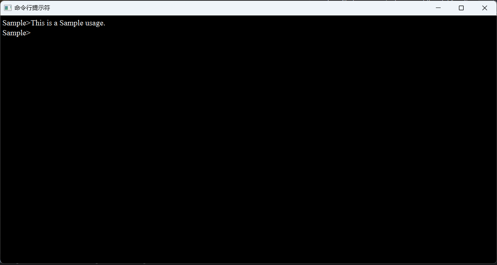

Use Qt to achieve something like this. All you need to do is add the CommandWidget class file to your project, connect the slot function `readMessage` to input information from the window, and signal `message` to read information from the window.The renderings are as follows.

